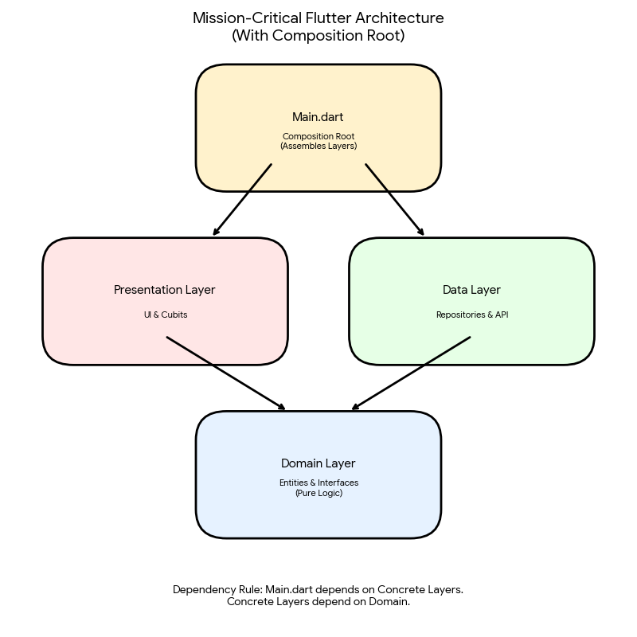
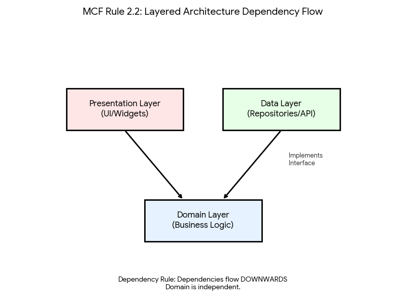
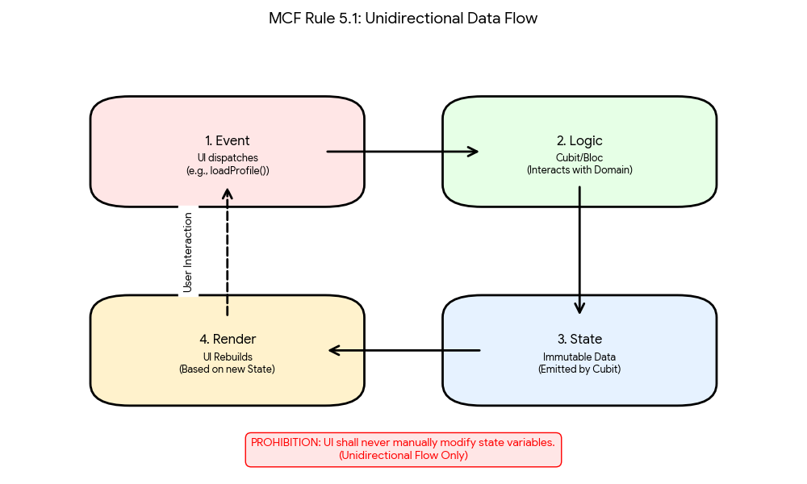

# Mission-Critical Flutter: FlightApp Reference Implementation


> **A High-Integrity Flutter application built with rigor, reliability, and strict engineering standards derived from the Joint Strike Fighter (JSF) C++ Coding Standards.**

---

## 📖 Overview

This repository acts as the reference implementation for the **Mission-Critical Flutter (MCF)** methodology. It demonstrates how to build safety-critical mobile applications where failure is not an option.

Unlike standard Flutter prototypes, this project prioritizes **determinism**, **type safety**, and **architectural isolation** over development speed. It enforces a strict subset of the Dart language to eliminate entire classes of runtime errors (e.g., `TypeError`, `NullPointer`, `RaceCondition`).

### **Core Philosophy**
1. **Architecture:** Strict separation of concerns (Presentation, Domain, Data).
2. **Safety:** Zero tolerance for `dynamic` types or implicit casting.
3. **State:** Unidirectional, immutable, and exhaustive state machines.
4. **Verification:** 100% logic coverage and pixel-perfect Golden tests.

---

## 🏗 Architecture

The project follows a rigorous **Clean Architecture** pattern with a strict **Composition Root**.

### The Composition Root
`main.dart` is the only file aware of all layers. It assembles the dependency graph before the app launches.

<p align="center">
  
</p>

### Dependency Flow (Rule 2.2)
Dependencies flow strictly **downwards**. The Domain layer is pure logic and knows nothing about the outer layers (UI or Data).

<p align="center">
  
</p>

```text
lib/
├── domain/            # PURE LOGIC (No Flutter, No JSON, No DB)
│   ├── entities/      # Core business objects (User, Address)
│   ├── failures/      # Domain-specific failure definitions
│   └── repositories/  # Abstract Interfaces (Contracts)
│
├── data/              # INFRASTRUCTURE (Dirty Layer)
│   ├── models/        # DTOs that parse JSON -> Entities
│   └── repositories/  # Concrete implementations (Http, Hive)
│
├── presentation/      # UI & STATE (Flutter)
│   ├── cubit/         # State Containers (Blinds Logic from UI)
│   └── screens/       # Stateless Widgets & Decomposed UI
│
└── main.dart          # COMPOSITION ROOT (Dependency Injection)
```

---

## 🔄 State Management (MCF Rule 5.1)

We utilize a strict **Unidirectional Data Flow**.  
The UI never manually mutates state — it dispatches events, which the Domain layer processes through Cubits.

<p align="center">
  
</p>

---

## 🛡️ MCF Compliance Checklist

This project adheres fully to the Mission-Critical Flutter standards:

- [x] **MCF 2.2:** Strict Layer Isolation (Dependency Inversion enforced)  
- [x] **MCF 3.1:** Strict analysis options (`strict-casts`, `strict-inference`)  
- [x] **MCF 3.4:** Zero usage of the bang operator `!`  
- [x] **MCF 4.1:** UI components default to `StatelessWidget`  
- [x] **MCF 5.1:** Strict unidirectional data flow via Cubits  
- [x] **MCF 6.5:** Heavy JSON parsing offloaded to isolates (`compute()`)  
- [x] **MCF 6.6:** Reentrancy guards on async actions  
- [x] **MCF 7.5:** Pixel-perfect visual verification via Golden Tests  

---

## 🚀 Getting Started

### **Prerequisites**
- Flutter SDK **3.10.0+**
- Dart SDK **3.0.0+** (required for sealed classes)

### **Installation**

1. Clone the repository:
```bash
git clone https://github.com/LosPhilly/mission-critical-flutter
cd flightapp
```

2. Install dependencies:
```bash
flutter pub get
```

3. Run the application:
```bash
flutter run
```

---

## 🧪 Verification & Testing

This project uses the **MCF Testing Pyramid**:

### **1. Unit Tests — Business Logic**
Ensures 100% branch coverage for Cubits & Repositories.

```bash
flutter test test/presentation/cubit/user_cubit_test.dart
```

### **2. Widget Tests — Behavioral Contracts**
Ensures UI wiring is correct.

```bash
flutter test test/presentation/screens/profile_screen_test.dart
```

### **3. Golden Tests — Visual Regression**
Ensures pixel-perfect rendering for critical displays.

Run:
```bash
flutter test test/presentation/screens/profile_screen_golden_test.dart
```

Regenerate Goldens:
```bash
flutter test --update-goldens
```

---

## 🔧 Technical Stack

| Layer | Technology |
|-------|------------|
| Framework | Flutter |
| Language | Dart (Strict Mode) |
| State mgmt | flutter_bloc |
| Immutability | equatable |
| Networking | http |
| Testing | mocktail, bloc_test |
| Linting | very_good_analysis (custom enforced) |

---

## 📄 License

Licensed under the **MIT License**. See LICENSE for more information.

> **"The difference between a prototype and a product is not features; it is predictability."**

---

## ✍️ Citation

If you use this architecture or reference it in research, please cite:

**Phillips, Carlos. (2025). _Mission-Critical Flutter: Building High-Integrity Applications._**

