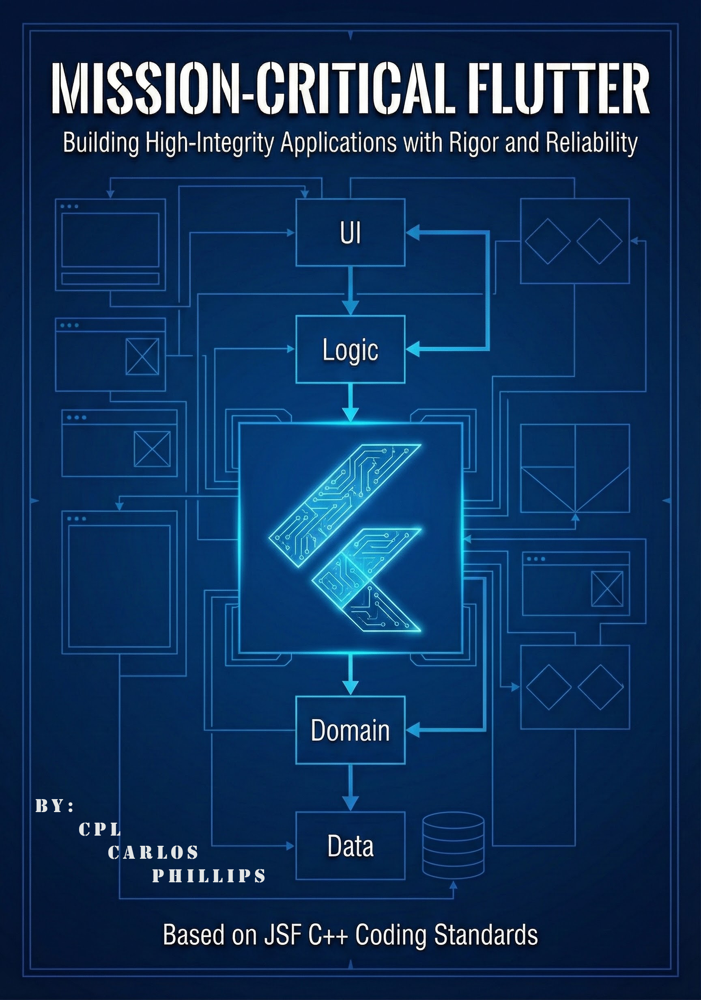

# Mission-Critical Flutter: FlightApp Reference Implementation



> **A High-Integrity Flutter application built with rigor, reliability, and strict engineering standards derived from the Joint Strike Fighter (JSF) C++ Coding Standards.**

---

## 📖 Overview

This repository acts as the reference implementation for the **Mission-Critical Flutter (MCF)** methodology. It demonstrates how to build safety-critical mobile applications where failure is not an option.

Unlike standard Flutter prototypes, this project prioritizes **determinism**, **type safety**, and **architectural isolation** over development speed. It enforces a strict subset of the Dart language to eliminate entire classes of runtime errors (e.g., `TypeError`, `NullPointer`, `RaceCondition`).

### **Core Philosophy**
1.  **Architecture:** Strict separation of concerns (Presentation, Domain, Data).
2.  **Safety:** Zero tolerance for `dynamic` types or implicit casting.
3.  **State:** Unidirectional, immutable, and exhaustive state machines.
4.  **Verification:** 100% logic coverage and pixel-perfect Golden tests.

---

## 🏗 Architecture

The project follows a rigorous **Clean Architecture** pattern with a strict **Composition Root**.

```text
lib/
├── domain/            # PURE LOGIC (No Flutter, No JSON, No DB)
│   ├── entities/      # Core business objects (User, Address)
│   ├── failures/      # Domain-specific failure definitions
│   └── repositories/  # Abstract Interfaces (Contracts)
│
├── data/              # INFRASTRUCTURE (Dirty Layer)
│   ├── models/        # DTOs that parse JSON -> Entities
│   └── repositories/  # Concrete implementations (Http, Hive)
│
├── presentation/      # UI & STATE (Flutter)
│   ├── cubit/         # State Containers (Blinds Logic from UI)
│   └── screens/       # Stateless Widgets & Decomposed UI
│
└── main.dart          # COMPOSITION ROOT (Dependency Injection)
Key Constraint: The Presentation Layer never imports the Data Layer. All communication occurs via Domain Interfaces.

🛡️ MCF Compliance Checklist
This project adheres to the Mission-Critical Flutter Audit Checklist:

[x] MCF 2.2: Strict Layer Isolation (Dependency Inversion Enforced).

[x] MCF 3.1: Strict Analysis Options (strict-casts, strict-inference).

[x] MCF 3.4: No usage of the bang operator (!).

[x] MCF 4.1: UI components are StatelessWidget by default.

[x] MCF 5.1: Unidirectional Data Flow via Cubits.

[x] MCF 6.5: Heavy JSON parsing offloaded to Isolates via compute().

[x] MCF 6.6: Reentrancy guards preventing race conditions on async actions.

[x] MCF 7.5: Critical UI components verified via Golden Tests.

🚀 Getting Started
Prerequisites
Flutter SDK 3.10.0 or higher.

Dart SDK 3.0.0 or higher (Required for sealed classes).

Installation
Clone the repository:

Bash

git clone [https://github.com/LosPhilly/mission-critical-flutter](https://github.com/LosPhilly/mission-critical-flutter)
cd flightapp
Install dependencies:

Bash

flutter pub get
Run the application:

Bash

flutter run
🧪 Verification & Testing
This project uses a "Testing Pyramid" strategy.

1. Unit Tests (Logic)
Verifies 100% of business logic branches (Cubits & Repositories).

Bash

flutter test test/presentation/cubit/user_cubit_test.dart
2. Widget Tests (Behavior)
Verifies the wiring between the UI and the State Management.

Bash

flutter test test/presentation/screens/profile_screen_test.dart
3. Golden Tests (Visual Regression)
Verifies pixel-perfect rendering of critical displays.

Run Verification:

Bash

flutter test test/presentation/screens/profile_screen_golden_test.dart
Generate/Update Goldens: If you modify the UI intentionally, regenerate the reference images:

Bash

flutter test --update-goldens
🔧 Technical Stack
Framework: Flutter

Language: Dart (Strict Mode)

State Management: flutter_bloc

Equality: equatable

Networking: http

Testing: mocktail, bloc_test

Linting: very_good_analysis (Customized)

📄 License
This project is licensed under the MIT License - see the LICENSE file for details.

"The difference between a prototype and a product is not features; it is predictability."

## ✍️ Citation

If you use this architecture in your projects or research, please credit the original work:

> [Phillips], [Carlos]. (2025). *Mission-Critical Flutter: Building High-Integrity Applications*.
